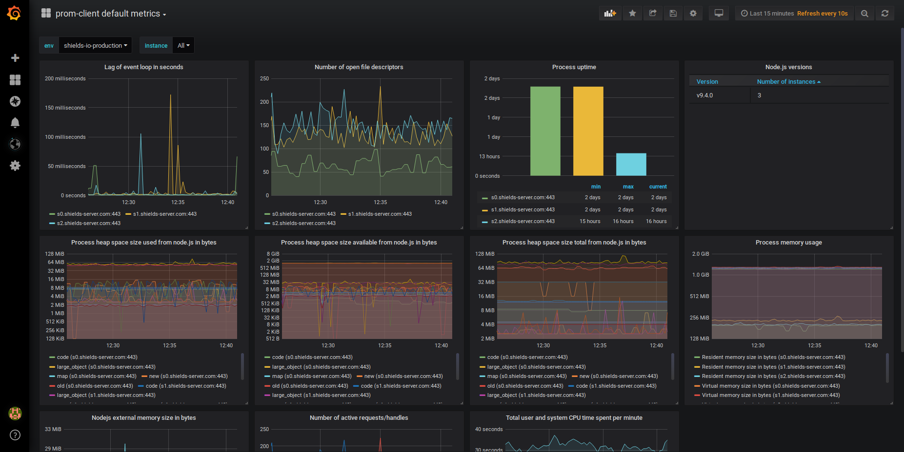
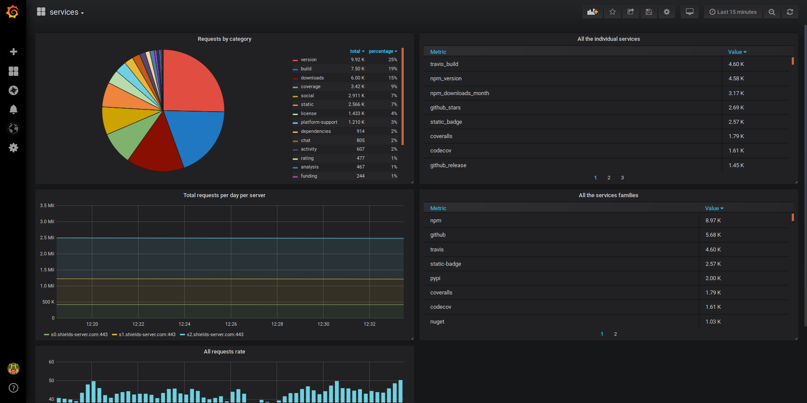

## Ansible playbook for https://metrics.shields.io

This [Ansible](https://www.ansible.com/) [playbook](https://docs.ansible.com/ansible/latest/user_guide/playbooks.html) can be used to setup monitoring (https://metrics.shields.io) for [Shields.io](https://shields.io/). It installs [Prometheus](https://prometheus.io/), [Grafana](https://grafana.com/), [NGINX](https://www.nginx.com/) and [Let's Encrypt](https://letsencrypt.org/) certificates (using [Certbot](https://certbot.eff.org/)).

Promethus configuration contains all [instances (servers)](https://github.com/badges/shields/blob/master/doc/production-hosting.md#badge-servers) of shields.io. Grafana contains dashboards and [worldPing](https://grafana.com/plugins/raintank-worldping-app) plugin. 

__If you want to make changes in existing Grafana dashboards you have to update [these files](grafana/dashboards) ([explanation + instruction](http://docs.grafana.org/administration/provisioning/#making-changes-to-a-provisioned-dashboard)) and run this role.__ You can always save changes as a new dashboard: Dashboard settings > Save As ...

worldPing has to be [enabled manually](https://grafana.com/plugins/raintank-worldping-app/installation). It also requires Grafana.com API Key. 

 

### How to use it?

1. Install Ansible ([doc](https://docs.ansible.com/ansible/latest/installation_guide/intro_installation.html))
2. Prepare an inventory file `inventory.ini`:
```ini
metrics ansible_host=metrics.example.com ansible_port=22 ansible_user=ubuntu ansible_python_interpreter=/usr/bin/python3
```
3. Copy a SSH key to remote server
4. Install required Ansible roles:
```bash
ansible-galaxy install -r requirements.yml
```
5. Define properties in `variables.yml`:
```yml
metrics_domain: metrics.example.com
mertics_grafana_admin_password: !vault |
          $ANSIBLE_VAULT;1.1;AES256
          ...
metrics_grafana_github_client_id: github_client_id
metrics_grafana_github_client_secret: !vault |
          $ANSIBLE_VAULT;1.1;AES256
          ...
mertics_prometheus_password: !vault |
          $ANSIBLE_VAULT;1.1;AES256
          ...
metrics_certbot_email: metrics@example.com
```
E-mail address (`metrics_certbot_email`) is used by Certbot for notification about certificates that are about to expire ([doc](https://certbot.eff.org/docs/using.html)).

You can encrypt passwords/cesrects using [Ansible Vault](https://docs.ansible.com/ansible/latest/user_guide/vault.html):
```bash
ansible-vault encrypt_string password123 --ask-vault-pass
```
6. Run a playbook:
```bash
ansible-playbook shields-io-metrics.yml -i inventory.ini -e @variables.yml --ask-vault-pass --ask-become-pass
```

### https://metrics.shields.io/

https://metrics.shields.io/ uses one single-core virtual host with 2 GB RAM [VPS SSD 1](https://www.ovh.com/world/vps/vps-ssd.xml) with Ubuntu 18.04.

#### GitHub authentication
Grafana allows to authenticate with [GitHub](http://docs.grafana.org/auth/github/). At https://metrics.shields.io maintainers from core team can log into Grafana using GitHub with 'Editor' role. Currently [GitHub OAuth application](http://docs.grafana.org/auth/github/#configure-github-oauth-application) used for owned by [@platan](https://github.com/platan). 

### Testing/running locally

Vagrant can be used to test the configuration or run monitoring locally ([documentation](https://docs.ansible.com/ansible/latest/scenario_guides/guide_vagrant.html)).
1. Start a virtual server and run the playbook:
```bash
# go to repo directory
cd repo-dir
vagrant up
```

2. Now you can visit:
- Grafana: http://localhost:8081
- Prometheus: http://localhost:8081/prometheus

Credentials are defined in `variables-local.yml`.

Finally you can stop (`vagrant halt`) or remove (`vagrant destroy`) the virtual server.
